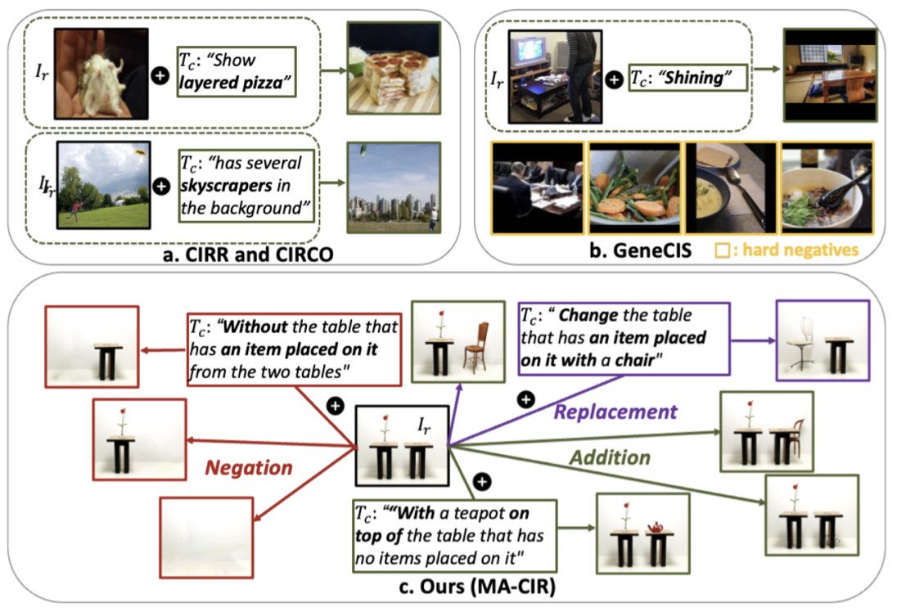

This is the official PyTorch implementation of "MACIR: A Multimodal Arithmetic Benchmark for Composed Image Retrieval" (Accepted to ICCV 2025)

## Overview

Composed Image Retrieval (CIR) seeks to retrieve a target image by using a reference image and conditioning text specifying desired modifications. While recent approaches have shown steady performance improvements on existing CIR benchmarks, we argue that it remains unclear whether these gains genuinely reflect an enhanced compositional understanding of both visual and textual information.
For example, current benchmarks do not explicitly consider negation cases and offer limited semantic diversity, with insufficient hard negatives to thoroughly evaluate the CIR task.
To bridge this gap, we introduce Multimodal Arithmetic Benchmark for CIR (MA-CIR), a challenging CIR benchmark that integrates arithmetic types (negation, replacement, and addition) across seven complex semantic categories (e.g., spatial reasoning, object reasoning, etc). Moreover, carefully constructed hard negatives are incorporated to assess models in a controlled setting.
In MA-CIR, we observe that current CIR models struggle with negation (or replacement) arithmetic types and semantic types that require complex reasoning, indicating a potential reliance on object or concept information.
To tackle this, we propose leveraging strong text encoders, particularly those based on large language models (LLMs), and fine-tuning them using carefully constructed text triplets that include hard negatives, thereby enhancing their compositional understanding.

## MACIR dataset 
This will be available soon

## Evaluation
This will be available soon

## Acknowledgement
Our code implementation is largely borrowed from [LinCIR](https://github.com/navervision/lincir/tree/master) and [E5-V](https://github.com/kongds/E5-V). We appreciate the original authors for their invaluable contributions.
